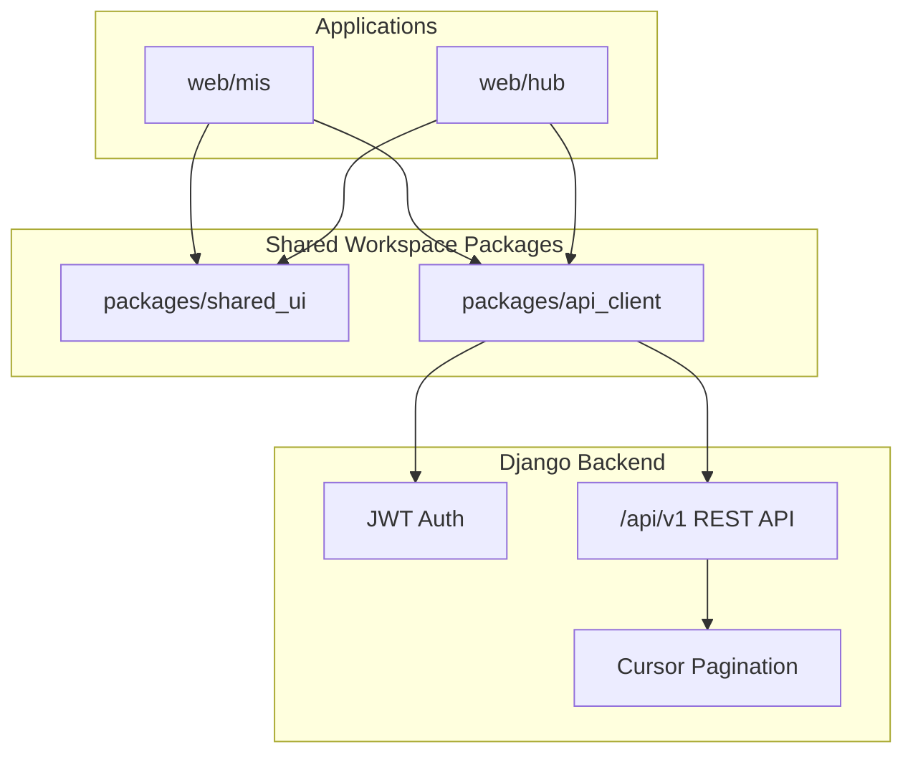

# Premium Frontend Implementation

This document records the implemented premium frontend rebuild for both MIS apps:

- `web/mis` — user-facing laboratory operations workspace
- `web/hub` — administrator/operator control plane
- `packages/shared_ui` — reusable premium design primitives
- `packages/api_client` — backend-compatible Django REST API client

## Architecture



## Backend Compatibility

The rebuild is aligned to the Django backend instead of the previous SuperTokens-only frontend flow.

| Concern | Implementation |
|--------|----------------|
| Login | `POST /api/v1/users/auth/login/` |
| Token refresh | `POST /api/v1/users/auth/refresh/` |
| Current user | `GET /api/v1/users/me/` |
| Auth header | `Authorization: Bearer <access_token>` |
| API base | `VITE_PUBLIC_API_ENDPOINT`, expected to end with `/api/v1/` |
| Pagination | Cursor shape: `{ next, previous, results }` |
| Tenant context | Optional `X-Org-Id` header |
| IoT visibility | Surfaces expose RFID/machine API-key readiness concepts |

## Shared Packages

### `@mono/api_client`

Location: `packages/api_client/src/index.ts`

Provides:

- `MisApiClient`
- `apiClient` singleton
- JWT token storage
- Login / refresh / current user helpers
- Cursor pagination helpers
- Normalized API error handling
- Backend endpoint builders grouped by domain

### Premium Shared UI

Location: `packages/shared_ui/src/components/premium`

Provides:

- `PremiumShell`
- `KpiCard`
- `InsightCard`
- `PremiumDataTable`
- `StatusBadge`
- `EmptyState`
- `SectionHeader`

## Role-based navigation (RBAC)

Lab sidebar items are filtered from the user’s **lab role permissions** (`module:action` codenames from IAM, e.g. `machines:read`, `attendance:write`).

- API: `GET /api/v1/labs/organisations/{orgId}/labs/{labId}/my-permissions/`
- **Lab Member (student)**: Dashboard, Projects, Machines, Inventory, Attendance + Notifications, Profile.
- **Lab Manager**: Manager dashboard (approvals pulse, team, settings, reports links); sidebar — Dashboard, Approvals, Lab settings, Lab members, Reports + account basics.
- **Organisation admin** (in lab): Full sidebar — all student modules plus Cart, My orders, approvals, settings, members, reports. Scan machine removed.
- **Create organisation**: shown for users with **no org yet** or **org admin** on any organisation (founders can create multiple tenants).
- **Organisation home (`/`)**: uses the same `SectionHeader` + `PremiumDataTable` pattern as other premium pages (no separate marketing hero).
- Backfill existing orgs: `python manage.py sync_default_role_permissions`
- Frontend: `LabPermissionsProvider` + `buildMisNav()` in `web/mis/src/premium/nav-policy.ts`
- Organisation admins see org billing/users; lab members only see items their role allows.

## SaaS signup paths

| Path | Who | Result |
|------|-----|--------|
| `/register` | New user | Account → home → create org **or** join lab **or** accept invite |
| `/create-organization` | Org founder | New tenant + first lab setup |
| `/request_lab` | Member/student | Join request → manager approves in **Approvals** |
| Profile → invites | Invited user | Accept/reject org/lab invite or paste token |

## MIS App Routes

| Route | Purpose |
|------|---------|
| `/login` | JWT login |
| `/` | Organisation switcher |
| `/create-organization` | Create organisation workflow scaffold |
| `/:orgId/dashboard` | Organisation dashboard |
| `/:orgId/labs` | Lab catalogue |
| `/:orgId/users` | Organisation members |
| `/:orgId/billing` | Subscription and invoice surface |
| `/:orgId/lab/:labId/dashboard` | Lab operations cockpit |
| `/:orgId/lab/:labId/inventory` | Inventory list |
| `/:orgId/lab/:labId/machines` | Machine list and IoT readiness |
| `/:orgId/lab/:labId/projects` | Project list |
| `/:orgId/lab/:labId/attendance` | Attendance records |
| `/:orgId/lab/:labId/approvals` | Approval inbox scaffold |

## Admin Hub Routes

| Route | Purpose |
|------|---------|
| `/login` | JWT operator login |
| `/dashboard` | Platform dashboard |
| `/organisations` | Tenant list |
| `/organisations/:orgId` | Tenant support detail |
| `/organisations/:orgId/labs/:labId` | Lab operations read model |
| `/plans` | Public plan catalogue |
| `/system/health` | API health panel |

## Environment

```bash
VITE_PUBLIC_API_ENDPOINT=https://api.example.com/api/v1/
VITE_PUBLIC_WEB_ENDPOINT=https://app.example.com
VITE_PUBLIC_RPAY_FE_KEY=<razorpay-key>
VITE_PUBLIC_RPAY_SCRIPT=https://checkout.razorpay.com/v1/checkout.js
VITE_PUBLIC_SUPPORT_EMAIL=support@example.com
VITE_PUBLIC_METABASE_ENDPOINT=https://admin.example.com/reporting
```

## Build Validation

Run from `client/monorepo`:

```bash
pnpm --filter mis build
pnpm --filter hub build
```

Both builds validate TypeScript and Vite production bundles for the rebuilt app surfaces.

## QA Checklist

- [ ] JWT login succeeds against `/api/v1/users/auth/login/`
- [ ] Access token is sent on protected requests
- [ ] Token refresh replays failed authenticated requests
- [ ] Organisation switcher loads cursor-paginated organisations
- [ ] Organisation dashboard loads labs, members, subscriptions
- [ ] Lab dashboard loads machines, inventory, projects
- [ ] Admin Hub dashboard loads organisations and API health
- [ ] `/system/health` shows DB/cache status
- [ ] Empty states render cleanly when backend returns no records
- [ ] Mobile viewport is responsive (`width=device-width`)
- [ ] Render static hosting rewrites all SPA routes to `/index.html`

## Notes

The old frontend source remains in place but is no longer routed by the premium route maps. This makes the rebuild reversible during review while moving the active UI to the JWT-compatible premium shell.
